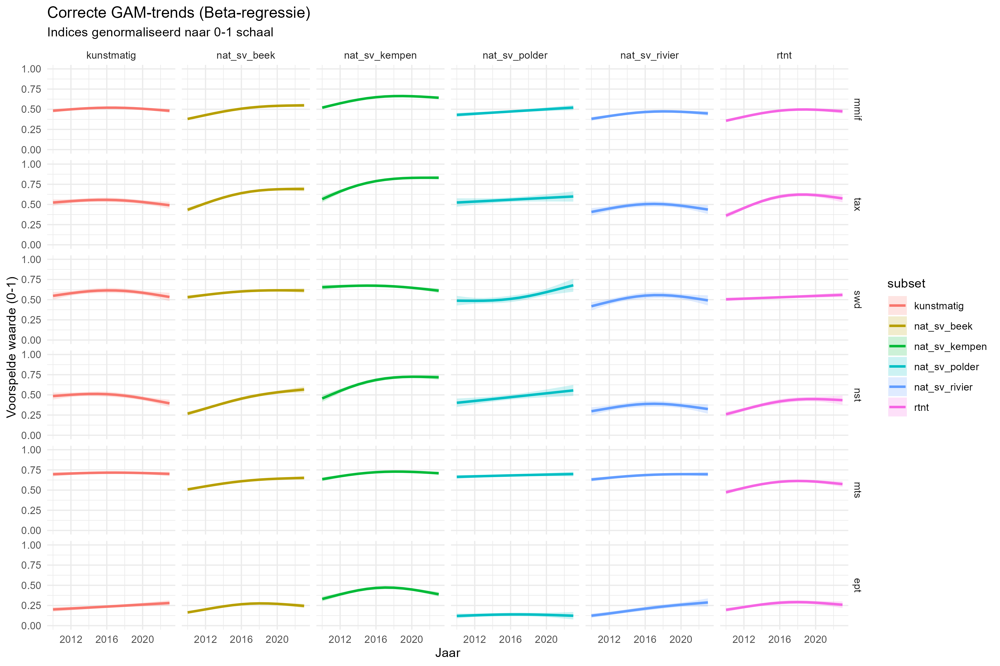
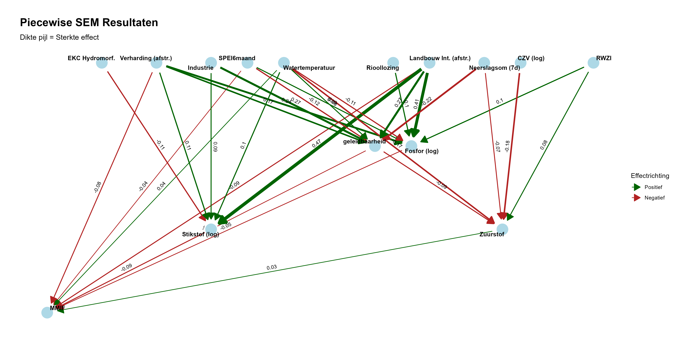

Voor het **Natuurrapport 2026 (NARA26)** voeren we een diepgaande analyse uit naar de biodiversiteit in de waterlopen in Vlaanderen en de drukfactoren die deze beïnvloeden. We focussen hierbij specifiek op drie biologische groepen: **macro-invertebraten, macrofyten en vissen.**

## Databronnen en Methodiek

De basis voor dit onderzoek wordt gevormd door monitoringsdata van de **Kaderrichtlijn Water (KRW)**. Deze gegevens worden verzameld door de **VMM** (macro-invertebraten, macrofyten, fytobenthos, hydromorfologie, fysico-chemie en vervuilende stoffen) en het **INBO** (vissen).

Hoewel de KRW-rapportage gebruikmaakt van verzamelindexen om de waterkwaliteit weer te geven, schieten deze vaak tekort voor een gedetailleerde ecologische analyse:

-   **Het OOAO-principe (One Out, All Out):** Geaggregeerde indexen maskeren vaak onderliggende trends. Een slechte score op één deelmaatlat of biologische groep kan de vooruitgang op andere vlakken onzichtbaar maken.

-   **Typologie en Statuut:** Door data van verschillende watertypes (zoals beken, Kempense beken en rivieren) te bundelen, gaan nuances verloren. Een opgesplitste analyse per watertype biedt een ecologisch nauwkeuriger beeld.

Het doel van deze analyse is om via de onderliggende deelmetrieken de werkelijke veranderingen in biodiversiteit bloot te leggen. We onderzoeken specifiek welke **drukfactoren** de verschillende biotische groepen beïnvloeden en op welke **ruimtelijke schaal** deze effecten spelen.

Onderstaand overzicht geeft de resultaten van de drukanalyse voor macro-invertebraten.

### Macro-invertebraten

#### Beschikbare data

Voor de analyse van de macro-invertebraten beschikken we over de data van **1989 tot 2023**, bestaande uit de **Belgische Biotische Index (BBI)** en de **Multimetrische Macro-invertebratenindex (MMIF)**.

Hoewel het monitoringsprogramma sinds 2007 volledig is afgestemd op de Europese Kaderrichtlijn Water (KRW), hebben we de focus voor deze analyse vernauwd naar de periode **vanaf 2010** omdat vanaf dat jaar consistente en koppelbare data voor **fysico-chemie** beschikbaar werd gesteld, wat essentieel is voor de drukanalyse.

#### Indeling van de monitoringsdata

Voor een nauwkeurige drukanalyse hebben we de monitoringsdata opgedeeld in zes ecologisch relevante subsets. Hierbij maken we onderscheid tussen het type waterloop, het statuut en de schaal (Vlaams, L1 of L2):

**Natuurlijke en sterk veranderde waterlopen (Vlaams & L1)**

Deze zijn onderverdeeld in vier hoofdtypes:

1.  **Beken:** Kleine en grote beken (excl. Kempen).

2.  **Kempense beken:** Kleine en grote Kempense beken.

3.  **Rivieren:** Kleine, grote en zeer grote rivieren.

4.  **Polderlopen:** Zowel zoete als brakke poldersystemen.

In deze analyse worden **natuurlijke** en **sterk veranderde** waterlopen als één groep behandeld. De reden hiervoor is dat sterk veranderde waterlopen in essentie natuurlijke systemen zijn; het statuut is slechts een administratieve toekenning voor waterlopen die sterk gewijzigd zijn door menselijk ingrijpen. Omdat de ecologische potentie en de basistypologie van deze systemen van nature gelijk zijn, beschouwen wij ze in deze drukanalyse als één geheel.

**Overige subsets**

5\. **Kunstmatige waterlopen:** Volledig kunstmatige systemen (zoals kanalen).

6\. **Kleine bovenstroomse, lokale waterlopen (L2):** hoofdzakelijk gelegen op onbevaarbare waterlopen van categorie 2.

### Drukken: omgevingsvariabelen

#### Fysico-chemische basisparameters

Variabelen zoals **temperatuur, pH, opgeloste zuurstof (**$O_2$) en geleidbaarheid ($EC_{20}$) worden standaard gemeten bij elke staalname van macro-invertebraten (MI). Voor macrofyten (MAFY) wordt hieraan de **Secchi-diepte** (doorzicht) toegevoegd.

#### Nutriënten en chemische belasting

Daarnaast analyseren we parameters zoals **totaal stikstof (**$N_t$), totaal fosfor ($P_t$), zwevende stof (ZS) en chemisch zuurstofverbruik (CZV).

Omdat deze nutriënten niet standaard bij elke biologische staalname worden gemeten, is een specifiek **koppelingsprotocol** ontwikkeld om de MI-metingen in tijd en ruimte te verbinden met de meest relevante meetpunten voor waterkwaliteit.

##### Methodiek: Het Koppelingsprotocol

[Code Github](https://github.com/inbo/toestand-waterlopen/blob/main/source/koppeling/koppeling_biota_fc_finaal.R)

De koppeling tussen MI-metingen en nutriëntendata gebeurt via een **netwerkanalyse (graaf)**. Hierbij wordt gebruikgemaakt van een fijnmazig riviermodel met segmenten van maximaal 200 meter met stroomrichting.

Voor elke MI-meting selecteert een script de best passende nutriëntenmeting op basis van de volgende criteria:

-   **Ruimtelijke nabijheid:**

    -   Punten binnen **5 km stroomopwaarts** (gemeten via de waterloop).

    -   Of punten binnen **200 meter vogelvlucht**.

    -   **Voorwaarde:** De match moet binnen dezelfde **VHAG-zone** liggen.

-   **Temporele nabijheid:**

    -   De nutriëntenmeting moet hebben plaatsgevonden in een venster van **180 dagen vóór** tot **30 dagen ná** de biologische staalname.

Indien er meerdere matches zijn, wordt de **dichtstbijzijnde meting** als definitieve koppeling geselecteerd voor de analyse.

#### **Hydromorfologie**

Hiervoor wordt gebruikgemaakt van de hydromorfologische kwaliteitsscore op waterlichaamniveau. Deze index geeft een algemeen beeld van de natuurlijkheid van de waterloop.

### Lozingsdruk van puntbronnen

[Code Github](https://github.com/inbo/toestand-waterlopen/blob/main/source/lozingen/lozingen_standardiseren_IE.R)

We analyseren de impact van diverse puntbronnen, waaronder industriële lozingen, RWZI-effluent, rioollozingen en riooloverstorten. De methodiek berekent de stroomopwaartse druk op elk biologisch meetpunt door lozingsvrachten te standardiseren en deze ruimtelijk te aggregeren via de functie `calculate_upstream_pressure`.

De kern van deze aanpak bestaat uit vier stappen:

-   **IE-Normalisatie:** Om verschillende lozingstypes vergelijkbaar te maken, worden vrachten van industrie en RWZI’s voor stoffen zoals CZV, N en P via specifieke omzettingsfactoren getransformeerd naar **Inwoners Equivalenten (IE)**. De waarde van de parameter met de hoogste IE (Max-IE) bepaalt hierbij de uiteindelijke lozingsdruk.

-   Voor rioollozingen zonder jaarlijkse data simuleren we een tijdreeks. Hierbij schatten we historische lozingswaarden op basis van de jaarlijkse evolutie in de gemeentelijke zuiveringsgraad.

-   **Netwerkanalyse met Distance Decay:** We identificeren alle lozingsbronnen binnen een straal van **5 km stroomopwaarts**. De impact van elke bron wordt gewogen met een *distance decay*-functie: naarmate de afstand tot het meetpunt groter is, neemt de berekende impact af. De snelheid van dit verval verschilt per type lozing; zo is het verval voor incidentele overstorten groter dan voor continue RWZI-lozingen.

-   Overstortdruk: een drukindex werd berekend op gelijke wijze als hierboven. Hiervoor werd gebruik gemaakt van de VMM datalaag met overstorten die uitlaten in een VHA waterloop. De berekende index combineert de **locatie van overstorten** met een inschatting van hun **frequentie en intensiteit** (ipv IE van de lozing) binnen een specifiek A0-afstroomgebied (blootstellingsfactor in prioriteringsoefening).

### Landgebruik

De impact van landgebruik op drie verschillende ruimtelijke schalen: het **volledige afstroomgebied**, de **oeverzone** en een **lokale buffer (100m)** rond het meetpunt.

#### Ruimtelijke Afbakening

-   **Afstroomgebieden:** Op basis van een digitaal hoogtemodel (DHM) is voor elk meetpunt de volledige oppervlakte bepaald waarbinnen regenwater bovengronds naar het meetpunt toe stroomt. [Code op Github](https://github.com/inbo/toestand-waterlopen/blob/main/source/afstroomgebieden.R)

-   **Oeverzones:** Deze zones zijn gedefinieerd over een specifiek traject stroomop- en stroomafwaarts, waarbij de breedte van de oever afhankelijk is van het type waterloop.

#### Verharding en Natuur

Voor het bepalen van de mate van verharding en het aandeel natuur maken we gebruik van de **landgebruikskaarten** (tijdsstappen 2013, 2016, 2019 en 2022). Elke biologische meting wordt voor de analyse gekoppeld aan het chronologisch dichtstbijzijnde jaar van de landgebruikskaart.

#### Landbouwintensiteit

[Code Github](https://github.com/inbo/toestand-waterlopen/blob/main/source/landgebruik/landgebruik_landbouw_afstroomgebied.R)

De landbouwdruk wordt berekend door de jaarlijkse **landbouwgebruikspercelenkaarten** te kruisen met de hierboven beschreven ruimtelijke zones.

Aan elk gewastype is een score toegekend voor het gebruik van **gewasbeschermingsmiddelen en nitraatresiduen**. Het resultaat is een oppervlakte-gewogen jaarscore die de potentiële impact van landbouwactiviteiten op de waterkwaliteit weergeeft.

### **Hydrologie - Klimaat**

[Code op Github](https://github.com/inbo/toestand-waterlopen/blob/main/source/hydrologische_variabelen.R)

Om de invloed van weersomstandigheden op de biodiversiteit te vatten, berekenden we drie hydrologische variabelen voor het volledige afstroomgebied van elk meetpunt. Deze geven een beeld van zowel **chronische stress** (langdurige droogte) als **acute verstoringen** (extreme neerslag).

-   **SPEI6 (Standardized Precipitation Evapotranspiration Index):** Deze droogte-index meet de balans tussen neerslag en verdamping over een periode van zes maanden. De SPEI6 is een indicator voor de **baseflow** (basisafvoer) van een waterloop. Voor de berekening is de periode **1991–2020** als referentie gehanteerd. Een langdurig neerslagtekort leidt tot lagere waterstanden en een verminderde verdunning van lozingen, wat resulteert in hogere concentraties vervuilende stoffen en kritisch lage zuurstofgehaltes.

-   **Extreme neerslagdagen:** Dit is het aantal extreme neerslagdagen in de 30 dagen voorafgaand van een MI meting met uitzonderlijk hoge neerslaghoeveelheden. Om te definiëren wat een "extreme neerslagdag" is, hebben we per afstroomgebied een specifieke drempelwaarde berekend op basis van het **95e percentiel (P95)** van de dagelijkse neerslagsom tijdens de referentieperiode (1991–2020). Dergelijke piekdagen veroorzaken hydraulische stress in de waterloop, waarbij organismen kunnen wegspoelen (drift) en riooloverstorten vaker in werking treden.

-   **Neerslagsom voorgaande 7 dagen:** Deze variabele meet de cumulatieve neerslag in de week voorafgaand aan de biologische staalname. Het geeft inzicht in de actuele verzadiging van het bekken en de directe impact van afspoeling (sediment en nutriënten) op de waargenomen biodiversiteit op het moment van bemonstering.

### Responsen

-   **MMIF**: De Multimetrische Macro-Invertebraten Index Vlaanderen, die het algemene beeld schetst. Som van de scores van 0-4 van de 5 deelmaatlatten geschaald tussen 0 en 1.

-   **Taxonomische rijkdom (ta_xw)**: Het absolute aantal waargenomen taxa.

-   **Shannon-Wiener diversiteit (sw_dw)**

-   **Mean Stress Tolerance Score (mt_sw_prop)**: De **genormaliseerde gemiddelde tolerantiescore** berekend als de som van de individuele tolerantiescores gedeeld door het aantal aanwezige taxa, waarbij het resultaat naar een schaal van 0 tot 1 werd herleid.

-   **Aantal stress-tolerante soorten (nst_prop)**: Het aandeel taxa dat gevoelig is aan verstoring (tolerantiescore \> 6; exclusief EPT).

-   **Aantal EPT-soorten (ept_prop)**: Het aandeel gevoelige taxa behorende tot de Ephemeroptera, Plecoptera en Trichoptera.

#### Functionele diversiteit en community gewogen trait waarden

We selecteerden 8 eigenschappen (Tachet traits): dispersie, voorbeweging, reproductie, saprobiteit, stroomsnelheid, trofisch status respiratie en substraat. Deze leren ons hoe een gemeenschap functioneert. Op basis hiervan berekenden we community gewogen trait waarden die ons iets leren over het functioneren van de MI gemeenschap.

Op basis van deze traits kunnen we ook kijken naar de functionele diversiteit van gemeenschappen van ongewervelden in de waterlopen. Functionele diversiteit is een maat van hoe divers de eigenschappen zijn van een gemeenschap. Zo kunnen er veel verschillende soorten aanwezig zijn, maar deze kunnen allemaal dezelfde eigenschappen of strategiën hebben. Een hoge functionele diversiteit wijst op een gezond ecosysteem dat beter bestand is tegen drukken en verstoringen.

De eigenschappen zijn geselecteerd uit de Tachet trait databank: dispersie, voorbeweging, reproductie, saprobiteit, stroomsnelheid, trofisch status respiratie en substraat.

## Analysemethode

[Code Github voor macro-invertebraten in natuurlijke en sterk veranderde beken](https://github.com/inbo/toestand-waterlopen/blob/main/source/analyse/sem/mi_nat_sv_beek/subset_mi_nat_sv_beek.R)

Het doel van de analyse is om een ecologisch logisch en *parsimonious* model te bouwen dat de complexe relaties tussen drukfactoren en biologische respons verklaart. We hanteren hiervoor een stapsgewijze aanpak:

### Stap 1: Voorbereiding en Variabelenselectie

Om instabiliteit in de modellen te voorkomen, filteren we vooraf variabelen met een te hoge onderlinge correlatie ($r > 0.7$) of een hoge mate van multicollineariteit (op basis van de *Variance Inflation Factor*, VIF).

### Stap 2: Model-Dredging

Per responsvariabele (zowel de biologische indexen als de sturende fysico-chemische factoren) fitten we een globaal *mixed-effects* model (`glmmTMB`). We gebruiken hierbij specifieke verdelingen die passen bij de aard van de data:

-   **Ordbeta:** Voor indexen en proporties tussen 0 en 1 (zoals de MMIF en MTS).

-   **Poisson:** Voor taxa-aantallen.

-   **Binomiaal:** Voor proporties ept-, stressgevoelige (nst) soorten.

-   **Gaussian:** Voor log-getransformeerde nutriëntconcentraties, EC20, ...

Om de herhaalde metingen en de ruimtelijke structuur van de dataset correct te analyseren, maken we gebruik van **Generalized Linear Mixed Models (GLMM)** via het `glmmTMB` package.

De modelstructuur is als volgt opgebouwd:

-   **Fixed effect (Jaar):** We nemen 'jaar' op als fixed effect om de temporele trends in de biodiversiteit en drukfactoren over de volledige studieperiode te identificeren.

-   **Random effects (Meetplaats & Bekken):**

    -   **Meetplaats:** Door meetplaats als random effect op te nemen, corrigeren we voor de afhankelijkheid tussen herhaalde waarnemingen op dezelfde locatie (*repeated measures*).

    -   **Bekken:** Een extra random effect voor bekken vangt de ruimtelijke variatie en omgevingsverschillen op tussen de verschillende stroomgebieden in Vlaanderen.

Via de `dredge`-functie worden alle mogelijke combinaties van ecologisch relevante predictoren getest en gerangschikt op basis van de **AICc**. Om de complexiteit en rekentijd te beperken werden per gedredged model 4 parameters toegestaan (inclusief jaar). Hieruit selecteren we het best presterende model.

### Stap 3: Opbouw van het Piecewise SEM (pSEM)

De individuele topmodellen voor biologie en chemie worden samengevoegd in één overkoepelend SEM (**Piecewise SEM**). Dit netwerk maakt het mogelijk om zowel **directe effecten** (bijv. landgebruik $\rightarrow$ biologie) als **indirecte effecten** (bijv. landgebruik $\rightarrow$ nutriënten $\rightarrow$ biologie) te kwantificeren.

### Stap 4: Modelevaluatie en Verfijning

Het initiële pSEM wordt getoetst aan de hand van *directed separation* (d-sep) en de *Fisher's C-statistiek* om de pasvorm te beoordelen. Op basis hiervan verfijnen we het model:

-   **Pad-optimalisatie:** Ontbrekende maar ecologisch relevante paden die significant blijken, worden toegevoegd.

-   **Stroomlijning:** Variabelen zonder verklarende kracht worden verwijderd.

-   **Gecorreleerde fouten:** Relaties tussen nauw verwante stuurvariabelen (zoals stikstof en fosfor) worden expliciet gemodelleerd om de betrouwbaarheid van de padcoëfficiënten te garanderen.

## Resultaten

Evolutie van gemiddelde van de MMIF en deelmaatlatten (score geschaald tussen 0 en 1) over de tijd (2010-2023). Effecten gefit op basis van gam model met beta distributie. Probleem: toont onzekerheid rond gemiddelde, die klein is. Ik zoek nog naar een betere weergave die ook variatie over de populatie heen geeft.



Voor elk van de subsets worden SEMs gebouwd voor de verschillende responsen. Hieruit trachten we gelijkaardige patronen of verschillen te extraheren. Piecewise structural equation model rond MMIF voor natuurlijke en sterk veranderde beken.

{width="4750"}

```{r echo = FALSE, warning = FALSE, message=FALSE}
library(here)
library(knitr)
library(kableExtra)
library(piecewiseSEM)
load(file = here("source", "analyse", "sem", "mi_nat_sv_beek", "mmif_sem_nat_sv_beek.rdata"))

sem_resultaat <- mmif_sem_nat_sv_beek
coefs_missing <- coefs(sem_resultaat)[,-9]
source(here("source", "analyse", "sem", "sem_standardised_coef_flexible.R"))
coefs_filled <- coefs_missing
coefs_filled %>% # Rond getallen af
  kable(format = "html", caption = "Piecewise SEM Pad-coëfficiënten") %>%
  kable_styling(bootstrap_options = c("striped", "hover", "condensed"),
                full_width = F,
                position = "left") %>%
  column_spec(8, color = ifelse(coefs_filled$P.Value < 0.05, "red", "black"), bold = T) # Markeer p < 0.05

# Je data in een object
r2_results <- rsquared(mmif_sem_nat_sv_beek)

# De tabel opbouwen
r2_results %>%
  mutate(across(c(Marginal, Conditional), ~ round(., 3))) %>%
  select(Response, family, Marginal, Conditional) %>%
  rename(
    `Afhankelijke Variabele` = Response,
    `Verdeling (Family)` = family,
    `R² Vast (Marginal)` = Marginal,
    `R² Totaal (Conditional)` = Conditional
  ) %>%
  kable(format = "html", caption = "Overzicht van verklaarde variantie per model-component") %>%
  kable_styling(bootstrap_options = c("striped", "hover", "condensed"), 
                full_width = F, 
                position = "center") %>%
  # Markeer de MMIF resultaten omdat dit je hoofd-outcome is
  row_spec(1, bold = TRUE, background = "#e6f2ff") %>% 
  # Voeg een visuele indicator toe voor de sterkte van de Marginal R2
  column_spec(3, 
              color = "white",
              background = spec_color(r2_results$Marginal, end = 0.7, option = "viridis"),
              bold = TRUE) %>%
  footnote(general = "De hoge Conditional R² waarden t.o.v. de Marginal R² duiden op een sterke invloed van de random effecten in de beken.")
```

#### Functionele diversiteit en community gewogen trait waarden

### Macrofyten

### koppeling MI-MAFY

extra beschaduwing

geen effect zuurstof

koppeling MI-VIS

#### Verontreinigende stoffen

subset

EC50 waarde uit ecotox

TU waarde pesticiden -\> TU max insecteciden

##### In het water

##### In biota

##### In de waterbodem

### Invasieve druk
